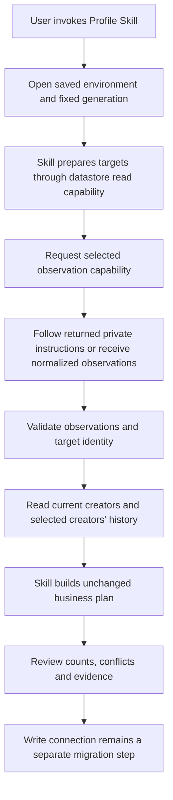

# Profile planning through a selected environment

This is the proposed environment connection for the existing recording Skill.
It prepares a business plan; it does not yet execute writes. Service acquisition,
field mapping, credentials and resource selection belong to the selected
Providers. The Runtime supplies access to those Providers. The Skill owns the
target manifest, observation validation and reconciliation decisions.



# Inputs and entry points

Use the environment file and generation supplied by the selected installation's
operator record. Do not choose an environment from the current working directory,
an ambient browser session or an installed package. A platform option overrides
the saved default only when the user selects that platform. The generic Runtime
must be available in the same selected installation; source-checkout links are
not production installation evidence.

The following commands run from the installed Skill directory. Paths are
placeholders for private files outside Git; the environment generation is the
exact value reported by the selected installation.

```sh
node scripts/profile_environment.mjs targets --environment /private/environment.json --generation GENERATION --mode selected --account synthetic.creator --output /private/targets.json
node scripts/profile_environment.mjs source --environment /private/environment.json --generation GENERATION --targets /private/targets.json --output /private/source-handoff.json
node scripts/profile_environment.mjs plan --environment /private/environment.json --generation GENERATION --targets /private/targets.json --observations /private/observations.json --output /private/profile-plan.json
```

Target selection retains the existing default due selection, limit 20 and
maximum 100. `selected` and `all` require the user's corresponding scope. The
datastore owns field resolution and returns normalized creator identities;
due selection preserves the due membership order. The Skill retains account
uniqueness and manifest validation.

The source handoff contains the correlated request, selected binding and, when
required, private operating instructions. Follow those instructions through the
authorized source session. Produce the normalized observation schema described
in [normalized-profile-observations.md](normalized-profile-observations.md).
For an instruction result envelope, use `--handoff /private/source-handoff.json
--source-result /private/source-result.json` instead of `--observations` in the
plan command. Runtime correlation validation does not prove source evidence;
the operator still verifies identities and visible evidence. Explicitly supplied
normalized observations remain supported without inventing Provider provenance.

# Decisions and output

Planning rereads creator identity and due membership when applicable. It always
requests history with the manifest's creator IDs; an empty manifest never turns
into a full-history read. Datastore normalization supplies stored values and
attachment hashes. No service field names or response parsing enter this path.

The existing reconciliation rules in [SKILL.md](../SKILL.md#reconciliation)
continue to govern. For example, one observed nickname with no matching history
produces one create; a matching existing observation produces zero creates; a
matching row with a missing observed avatar produces one attachment resume.
Unavailable values stay blank, conflicting candidates remain conflicts, and
invalid stored rows remain reported. No new business stop rule is introduced.

The output contains the original business plan/hash plus a separate receipt
hash binding that plan to the environment generation and timestamp mode.
The receipt is neither approval nor a write intent. Review the create and
attachment-resume counts, already-applied and unavailable rows, conflicts and
target issues. `businessWorkflowVerified: false` is expected because nothing
has been written or verified by business readback.

Avatar bytes must match the normalized size/hash and stay in an owner-only
regular file. The selected write Provider will enforce its media limits before
upload; this planning-only connection does not establish upload eligibility.

# Failure and human takeover

If environment generation, target identity, source correlation or timestamp mode
changes, preserve the private artifacts and prepare again from the current
selection. A failed Provider read is not an empty history: report the failure
and use that Provider's private evidence/troubleshooting route. Do not silently
switch endpoints, credentials, environments or the legacy writer.

A human can inspect the manifest and normalized observations, use the selected
Provider instructions to obtain the same normalized history, and reproduce the
business result with the exported `buildProfileSyncPlanFromHistory` function.
Read `plan.summary` and `plan.operations` to explain proposed effects and stop
reasons. This source comparison is not a completed human takeover exercise.

The published legacy route and current environment installation remain recovery
artifacts. This source addition does not register a host Skill, publish a package,
activate a schedule or change production. Completing the environment write and
readback connection is required before this path can register a profile.
