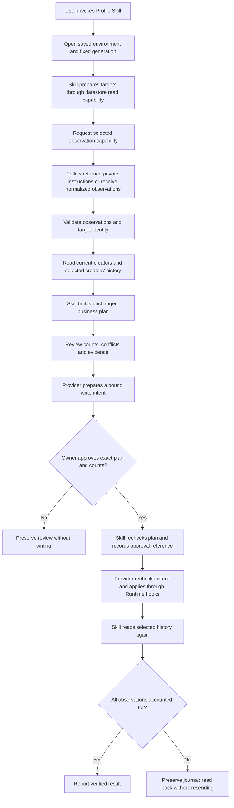

# Profile recording through a selected environment

This is the environment connection for the recording Skill.
It prepares and applies reviewed business plans. Service acquisition,
field mapping, credentials and resource selection belong to the selected
Providers. The Runtime supplies access to those Providers. The Skill owns the
target manifest, observation validation, approval and reconciliation decisions.
The CLI is an operator entry point: run its apply command only after obtaining
the owner's actual approval of the displayed plan and counts.



# Inputs and entry points

Use the environment file and generation supplied by the selected installation's
operator record. Do not choose an environment from the current working directory,
an ambient browser session or an installed package. A platform option overrides
the saved default only when the user selects that platform. The generic Runtime
must be available in the same selected installation; source-checkout links are
not production installation evidence.

The following commands run from the installed Skill directory. Paths are
placeholders for private files outside Git; the environment generation is the
exact value reported by the selected installation.

```sh
node scripts/profile_environment.mjs targets --environment /private/environment.json --generation GENERATION --mode selected --account synthetic.creator --output /private/targets.json
node scripts/profile_environment.mjs source --environment /private/environment.json --generation GENERATION --targets /private/targets.json --output /private/source-handoff.json
node scripts/profile_environment.mjs plan --environment /private/environment.json --generation GENERATION --targets /private/targets.json --observations /private/observations.json --output /private/profile-plan.json
node scripts/profile_environment.mjs prepare-write --environment /private/environment.json --generation GENERATION --plan /private/profile-plan.json --output /private/profile-write-review.json
```

Target selection retains the existing default due selection, limit 20 and
maximum 100. `selected` and `all` require the user's corresponding scope. The
datastore owns field resolution and returns normalized creator identities;
due selection preserves the due membership order. The Skill retains account
uniqueness and manifest validation.

The source handoff contains the correlated request, selected binding and, when
required, private operating instructions. Follow those instructions through the
authorized source session. Produce the normalized observation schema described
in [normalized-profile-observations.md](normalized-profile-observations.md).
For an instruction result envelope, use `--handoff /private/source-handoff.json
--source-result /private/source-result.json` instead of `--observations` in the
plan command. Runtime correlation validation does not prove source evidence;
the operator still verifies identities and visible evidence. Explicitly supplied
normalized observations remain supported without inventing Provider provenance.

# Decisions and output

Planning rereads creator identity and due membership when applicable. It always
requests history with the manifest's creator IDs; an empty manifest never turns
into a full-history read. Datastore normalization supplies stored values and
attachment hashes. No service field names or response parsing enter this path.

The existing reconciliation rules in [SKILL.md](../SKILL.md#reconciliation)
continue to govern. For example, one observed nickname with no matching history
produces one create; a matching existing observation produces zero creates; a
matching row with a missing observed avatar produces one attachment resume.
Unavailable values stay blank, conflicting candidates remain conflicts, and
invalid stored rows remain reported. No new business stop rule is introduced.

The output contains the original business plan/hash plus a separate receipt
hash binding that plan to the environment generation and timestamp mode.
The planning receipt is neither approval nor a write intent. Review the create and
attachment-resume counts, already-applied and unavailable rows, conflicts and
target issues. `businessWorkflowVerified: false` is expected because nothing
has been written or verified by business readback.

Avatar bytes must match the normalized size/hash and stay in an owner-only
regular file. The selected write Provider enforces its media limits before upload.

# Approval, execution and readback

`prepare-write` repeats planning from fresh reads, then asks the selected
`creator-profile-datastore-write/v1` capability for a private prepared intent.
It must preserve the exact plan hash, create/attachment counts, normalized
operations and environment selection. Concrete field mapping and destination
authorization stay inside the Provider. Preparation does not mutate the service.
A zero-effect plan returns `unchanged` and needs no apply.

Present `planningReceipt.plan.summary`, the plan SHA-256 and the selected
destination to the owner. Resolve conflicts before execution. Obtain approval
for that exact create and attachment count, including existing-image resumes.
Record a reference to the actual approval (for example its task/message ID).
A hash, reference string or generated JSON file does not prove human approval.
The trusted operator remains responsible for checking that the approval exists
and covers these effects; never invent it or automatically approve a new plan.

Only after approval, run the following with the reviewed values substituted.
The counts shown here are illustrative; they do not authorize one create.

```sh
node scripts/profile_environment.mjs apply --environment /private/environment.json --generation GENERATION --review /private/profile-write-review.json --expect-sha256 PLAN_SHA256 --confirm-profile-create 1 --confirm-profile-attach 0 --approval-ref ACTUAL_APPROVAL_REFERENCE --journal-directory /private/profile-journals --output /private/profile-result.json
```

The Skill rechecks the plan and records the exact approval before writing.
Runtime passes trusted process-local `authorizeIntent` and `onEvent` hooks to
the selected Provider; it rechecks the environment/configuration around approval.
The Provider independently rebuilds its intent, compares it with the prepared
review and preserves its upload-before-create and attachment-resume rules.
JSON request/configuration data cannot supply those callbacks or grant authority.
Library callers of `applyEnvironmentProfileWrite` must supply a trusted actual
approval check and durable event sink; the CLI implements an operator assertion
with the supplied reference and a private local journal.

Journal entries are flushed before dependent effects. The journal directory must
be private and owner-controlled; each review gets an exclusively created file.
Reusing that file is rejected before another mutation. This local guard is not
an authenticated approval store or a lock shared by other installations.
Keep the review, approval reference, journal and result together outside Git.

The Skill verifies the result with fresh scoped history and attachment hashes.
Only these reads may repeat, using the existing bounded readback sequence.
`businessWorkflowVerified: true` means the approved observations are accounted
for in those reads. It does not independently prove the source observation or
identify the creator of an already matching record. Synthetic verification is
not live business acceptance. A failed or malformed write reply may recover
through matching readback without sending the write again.

For an interrupted or unresolved attempt, use the read-only recovery command:

```sh
node scripts/profile_environment.mjs verify --environment /private/environment.json --generation GENERATION --review /private/profile-write-review.json --output /private/profile-recovery.json
```

If effects remain missing, inspect the journal and prepare a new plan for the
remainder. Obtain approval for that new plan before execution. Do not delete a
journal, change journal directories or resend the old review to bypass recovery.

# Failure and human takeover

If environment generation, target identity, source correlation or timestamp mode
changes, preserve the private artifacts and prepare again from the current
selection. A failed Provider read is not an empty history: report the failure
and use that Provider's private evidence/troubleshooting route. Library errors
and CLI stderr preserve `providerCode` and optional Provider-sanitized `details`;
the CLI keeps the outer `PROFILE_ENVIRONMENT_FAILED` code. Preserve those
diagnostics for the authorized operator. Older Providers may omit details;
their absence does not make the read successful or justify guessing the cause.
The Provider owns diagnostic sanitization and service-specific interpretation.
A failed planning read produces no new plan artifact. Do not silently
switch endpoints, credentials, environments or the legacy writer.

A human can inspect the manifest and normalized observations, use the selected
Provider instructions to obtain the same normalized history, and reproduce the
business result with the exported `buildProfileSyncPlanFromHistory` function.
Read `plan.summary` and `plan.operations` to explain proposed effects and stop
reasons. This source comparison is not a completed human takeover exercise.

The published legacy route and current environment installation remain recovery
artifacts. This source addition does not register a host Skill, publish a package,
activate a schedule or change production. Deployment requires compatible selected
Runtime and read/write capability bindings, an explicitly authorized destination
configuration, and separate installation/cutover acceptance. Version 2 excludes the old service-specific entry points from its archive and
exports. Source comparisons retain them as development-only fixtures; use the
unchanged version 1.2.0 installation for an explicitly selected legacy workflow.
