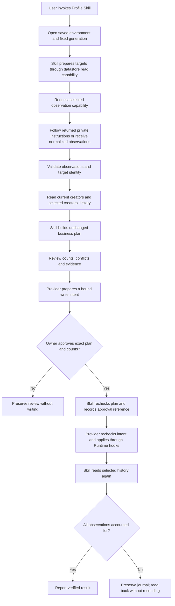

# Profile recording through a selected environment

This is the environment connection for the recording Skill.
It prepares and applies reviewed business plans. The selected Providers own
service acquisition and operations. The selected private environment supplies
resource, field-binding and credential references; those references do not make
the Provider the owner of the logical business schema or its meaning. The Runtime
supplies access to those Providers. The Skill owns the
target manifest, observation validation, approval and reconciliation decisions.
The CLI is an operator entry point: run its apply command only after obtaining
the owner's actual approval of the displayed plan and counts.


```mermaid
flowchart TD
  U[User invokes Profile Skill] --> E[Open saved environment and fixed generation]
  E --> T[Skill prepares targets through datastore read capability]
  T --> S[Request selected observation capability]
  S --> H[Follow returned private instructions or receive normalized observations]
  H --> V[Validate observations and target identity]
  V --> R[Read current creators and selected creators' history]
  R --> P[Skill builds unchanged business plan]
  P --> O[Review counts, conflicts and evidence]
  O --> W[Provider prepares a bound write intent]
  W --> A{Owner approves exact plan and counts?}
  A -->|No| Stop[Preserve review without writing]
  A -->|Yes| C[Skill rechecks plan and records approval reference]
  C --> X[Provider rechecks intent and applies through Runtime hooks]
  X --> R2[Skill reads selected history again]
  R2 --> V2{All observations accounted for?}
  V2 -->|Yes| Done[Report verified result]
  V2 -->|No| Unresolved[Preserve journal; read back without resending]
```

# Inputs and entry points

Use the environment file and generation supplied by the selected installation's
operator record. Do not choose an environment from the current working directory,
an ambient browser session or an installed package. A platform option overrides
the saved default only when the user selects that platform. The generic Runtime
must be available in the same selected installation; source-checkout links are
not production installation evidence.

The following commands run from the installed Skill directory. Paths are
placeholders for private files outside Git; the environment generation is the
exact value reported by the selected installation.

```sh
node scripts/profile_environment.mjs targets --environment /private/environment.json --generation GENERATION --mode selected --account synthetic.creator --output /private/targets.json
node scripts/profile_environment.mjs source --environment /private/environment.json --generation GENERATION --targets /private/targets.json --output /private/source-handoff.json
node scripts/profile_environment.mjs plan --environment /private/environment.json --generation GENERATION --targets /private/targets.json --observations /private/observations.json --output /private/profile-plan.json
node scripts/profile_environment.mjs prepare-write --environment /private/environment.json --generation GENERATION --plan /private/profile-plan.json --output /private/profile-write-review.json
```

Target selection retains the existing default due selection, limit 20 and
maximum 100. `selected` and `all` require the user's corresponding scope. The
datastore owns field resolution and returns normalized creator identities;
due selection preserves the due membership order. The Skill retains account
uniqueness and manifest validation.

The source handoff contains the correlated request, selected binding and, when
required, private operating instructions. Follow those instructions through the
authorized source session. Produce the normalized observation schema described
in [normalized-profile-observations.md](normalized-profile-observations.md).
For an instruction result envelope, use `--handoff /private/source-handoff.json
--source-result /private/source-result.json` instead of `--observations` in the
plan command. Runtime correlation validation does not prove source evidence;
the operator still verifies identities and visible evidence. Explicitly supplied
normalized observations remain supported without inventing Provider provenance.

# Acquisition checkpoints and continuation

Keep the saved targets and source handoff unchanged during one acquisition. Use
`scripts/profile_progress.mjs` to save progress in an existing owner-only directory
outside Git. This local helper reuses the private atomic-file writer and syncs the
directory after each checkpoint. It never opens a source session, accepts a source
result envelope, plans a write or grants authority. It binds progress to the entire
saved target receipt, including environment selection; changed targets require a
new progress file and explicit evidence review rather than automatic reuse.

```sh
node scripts/profile_progress.mjs init /private/targets.json /private/progress.json
node scripts/profile_progress.mjs record /private/targets.json /private/progress.json /private/creator-result.json
node scripts/profile_progress.mjs status /private/targets.json /private/progress.json
node scripts/profile_progress.mjs assemble /private/targets.json /private/progress.json /private/observations.json
```

Each private result has `creatorRecordId`, `accountKey`, `status`, `evidenceRefs`
(private evidence locations or identifiers), and, for `completed`, `observation`
containing one complete creator object from the normalized observation schema.
`partial` and `blocked` require a `reason`; they may retain a normalized observation
if available. For example, a partial synthetic result is:

```json
{"creatorRecordId":"recSyntheticA001","accountKey":"synthetic.a","status":"partial","evidenceRefs":["private-evidence:synthetic-a"],"reason":"Normalized observation not yet complete"}
```

Record a completed result only after checking the observation against its source
evidence and identity. The helper validates shape and identity, not evidence truth
or accessibility. A bare image path or an in-memory array cannot satisfy completion.
Here `completed` means a saved, validated final observation for an actually
attempted target, not success of every field. A usable profile with an unavailable
avatar, or a final observation with no available values, remains eligible for the
existing business planner's create/unavailable decisions. Field statuses do not
introduce a new whole-batch stop. Use `blocked` when authentication, ambiguous
identity or unsupported source schema prevents resolving the target attempt;
use `partial` when its observation is still unfinished. Preserve unavailable field
statuses without invented values, and never synthesize final observations for
untouched targets to satisfy assembly.
An identical repeated completed result is idempotent; a changed completed result
is rejected. Partial/blocked results can be replaced after their condition resolves.
Counts are per unique manifest target, not per attempt, image or browser visit.

After each target, save its result before continuing. On restart, run `status`
and inspect saved `remaining` identities and their partial/blocked reasons. Resume
only missing work under the same authority and source instructions. A target-local
problem does not stop independent authorized targets; a session-wide authority or
authentication failure stops acquisition using that session. The unattended-source
support gate still applies. Do not retry a blocker blindly or stop just because
the first target completed or a tool cycle ended.

Commands serialize access with an exclusive `.lock` file. A terminated process may
leave that lock: first establish that its process has stopped, preserve and inspect
the saved progress, then remove only the stale lock and run `status`. Do not remove
a live lock or edit a completed result. Atomic replacement preserves the prior or
new complete checkpoint on process interruption; unsaved work must be reacquired.
If a checkpoint is corrupt or unavailable, report the uncertainty rather than
reconstructing success from screenshots or filenames.

`assemble` requires completed observations for every original manifest row and
preserves manifest order. For an instruction-result route, use those saved rows
in the original correlated result and retain the existing `--handoff` and
`--source-result` validation; assembling rows does not supply Provider provenance.
For explicitly supplied normalized input, use the existing `--observations` path.
Do not drop blocked rows, weaken full-manifest validation or split an approved plan.

Acquisition is complete only when every target has a saved normalized observation;
this is not registration completion. Otherwise the terminal report is partial or
blocked and names the exact remaining targets, reasons, saved files and resumption
step. Derive acquisition counts from `status`, plan counts from the saved plan and
write/verification counts from the saved result and journal. Continue authorized
preparation through planning; pending actual plan approval is a separate gate.
Business completion still requires the readback below. Report these stages
separately instead of calling saved observations registered or verified.

## Host continuation prototype

`src/profile-continuation.mjs` is a deterministic, source-neutral prototype for
a selected host integration. It consumes the same saved targets and progress,
processes a bounded number of rows, and returns `continuation_required` if the
host ends before a result is saved. A subsequent host invocation supplies that
returned progress and resumes with the original first unfinished row. Completed
results remain immutable, while a target-local `partial` or `blocked` result can
be replaced only by a later final result for the same manifest identity.

The module is intentionally not an autonomous scheduler: it does not start a
browser, call a model, create a task, or run a timer. A host integration must
explicitly dispatch each next bounded turn and retain the existing unattended-
source, session, rate-limit, authority, and no-write gates. The synthetic
continuation test proves state transitions through a simulated `final_answer` /
`task_complete` boundary and 20-target completion; it does not prove that a live
host or model will avoid early final answers.

The paired synthetic comparison keeps the host `turn_ended` signal fixed while
varying a baseline and a strengthened continuation instruction. Both require a
new host invocation and retain all 20 rows. It is a negative-control contract
test, not a measurement of an LLM's instruction-following rate; run a separately
authorized live-host experiment before claiming a prompt effect.

# Decisions and output

Planning rereads creator identity and due membership when applicable. It always
requests history with the manifest's creator IDs; an empty manifest never turns
into a full-history read. Datastore normalization supplies stored values and
attachment hashes. No service field names or response parsing enter this path.

The existing reconciliation rules in [SKILL.md](../SKILL.md#reconciliation)
continue to govern. For example, one observed nickname with no matching history
produces one create; a matching existing observation produces zero creates; a
matching row with a missing observed avatar produces one attachment resume.
Unavailable values stay blank, conflicting candidates remain conflicts, and
invalid stored rows remain reported. No new business stop rule is introduced.

The output contains the original business plan/hash plus a separate receipt
hash binding that plan to the environment generation and timestamp mode.
The planning receipt is neither approval nor a write intent. Review the create and
attachment-resume counts, already-applied and unavailable rows, conflicts and
target issues. `businessWorkflowVerified: false` is expected because nothing
has been written or verified by business readback.

Avatar bytes must match the normalized size/hash and stay in an owner-only
regular file. The selected write Provider enforces its media limits before upload.

# Approval, execution and readback

`prepare-write` repeats planning from fresh reads, then asks the selected
`creator-profile-datastore-write/v1` capability for a private prepared intent.
It must preserve the exact plan hash, create/attachment counts, normalized
operations and environment selection. Concrete field mapping and destination
authorization stay inside the Provider. Preparation does not mutate the service.
A zero-effect plan returns `unchanged` and needs no apply.

Present `planningReceipt.plan.summary`, the plan SHA-256 and the selected
destination to the owner. Resolve conflicts before execution. Obtain approval
for that exact create and attachment count, including existing-image resumes.
Record a reference to the actual approval (for example its task/message ID).
A hash, reference string or generated JSON file does not prove human approval.
The trusted operator remains responsible for checking that the approval exists
and covers these effects; never invent it or automatically approve a new plan.

Only after approval, run the following with the reviewed values substituted.
The counts shown here are illustrative; they do not authorize one create.

```sh
node scripts/profile_environment.mjs apply --environment /private/environment.json --generation GENERATION --review /private/profile-write-review.json --expect-sha256 PLAN_SHA256 --confirm-profile-create 1 --confirm-profile-attach 0 --approval-ref ACTUAL_APPROVAL_REFERENCE --journal-directory /private/profile-journals --output /private/profile-result.json
```

The Skill rechecks the plan and records the exact approval before writing.
Runtime passes trusted process-local `authorizeIntent` and `onEvent` hooks to
the selected Provider; it rechecks the environment/configuration around approval.
The Provider independently rebuilds its intent, compares it with the prepared
review and preserves its upload-before-create and attachment-resume rules.
JSON request/configuration data cannot supply those callbacks or grant authority.
Library callers of `applyEnvironmentProfileWrite` must supply a trusted actual
approval check and durable event sink; the CLI implements an operator assertion
with the supplied reference and a private local journal.

Journal entries are flushed before dependent effects. The journal directory must
be private and owner-controlled; each review gets an exclusively created file.
Reusing that file is rejected before another mutation. This local guard is not
an authenticated approval store or a lock shared by other installations.
Keep the review, approval reference, journal and result together outside Git.
Also retain the original avatar files referenced by the review's observations,
at the same absolute paths with the same bytes and owner-only regular-file
permissions. Both planning and read-only `verify` validate those files' ownership,
size and SHA-256; remote attachment hashes alone do not replace them.

The Skill verifies the result with fresh scoped history and attachment hashes.
Preparation and the final prewrite check still require current due membership
for a due-mode plan, alongside the exact plan hash and environment selection.
Post-write and standalone `verify` instead reconcile the original reviewed
manifest and observations: a successful record may remove its creator from the
due view, so continued due membership is not a completion condition. The
manifest's mode and creator IDs are preserved. Creator existence, account
identity and uniqueness, selected history scope, stored values and avatar hashes
must still pass; missing effects or identity changes remain unresolved. For
example, a matching new profile and avatar can verify after the creator leaves
the due view, while an absent avatar still requires recovery. This readback path
does not authorize preparing or applying a write with stale due membership.
Only these reads may repeat, using the existing bounded readback sequence.
`businessWorkflowVerified: true` means the approved observations are accounted
for in those reads. It does not independently prove the source observation or
identify the creator of an already matching record. Synthetic verification is
not live business acceptance. A failed or malformed write reply may recover
through matching readback without sending the write again.

For an interrupted or unresolved attempt, use the read-only recovery command:

```sh
node scripts/profile_environment.mjs verify --environment /private/environment.json --generation GENERATION --review /private/profile-write-review.json --output /private/profile-recovery.json
```

If effects remain missing, inspect the journal and prepare a new plan for the
remainder. Obtain approval for that new plan before execution. Do not delete a
journal, change journal directories or resend the old review to bypass recovery.
If an original avatar file is missing or changed, restore the original bytes at
the referenced path with the required permissions before retrying verification.
If that is not possible, preserve the unresolved result and involve the authorized
operator; do not edit the old review's image metadata or repeat the write. The
current verification path cannot complete without those originals.

# Failure and human takeover

If environment generation, target identity, source correlation or timestamp mode
changes, preserve the private artifacts and prepare again from the current
selection. A failed Provider read is not an empty history: report the failure
and use that Provider's private evidence/troubleshooting route. Library errors
and CLI stderr preserve `providerCode` and optional Provider-sanitized `details`;
the CLI keeps the outer `PROFILE_ENVIRONMENT_FAILED` code for planning failures.
After a write, failed verification reads retain the same diagnostics through
`PROFILE_WRITE_OUTCOME_UNRESOLVED`, with `uncertainWrite: true`; preserve the
journal and verify without resending the write. When the Provider returns a
failed write, `writeFailure` retains its sanitized code and optional details in
the journal and result. A later failed verification read has its own
`readbackFailure`; the existing top-level read diagnostics remain available for
older consumers. If recording the readback failure also fails, the already-known
write and readback diagnostics remain in the thrown result and CLI error output;
the journal may be incomplete. These are separate observations: a readback failure does not
explain the earlier write failure or prove whether the write reached the service.
If readback succeeds but the observation is absent, the result remains
`unresolved`; inspect the retained write failure and prepare the missing remainder.
Older Providers may supply only a write code, and thrown calls may supply no
Provider diagnostic envelope. Do not infer a cause from missing diagnostics.
Preserve those
diagnostics for the authorized operator. Older Providers may omit details;
their absence does not make the read successful or justify guessing the cause.
The Provider owns diagnostic sanitization and service-specific interpretation.
A failed planning read produces no new plan artifact. Do not silently
switch endpoints, credentials, environments or the legacy writer.

A human can inspect the manifest and normalized observations, use the selected
Provider instructions to obtain the same normalized history, and reproduce the
business result with the exported `buildProfileSyncPlanFromHistory` function.
The function is available from `@flair-agency/creator-profile-record/profile-plan`.
Read `plan.summary` and `plan.operations` to explain proposed effects and stop
reasons. This source comparison is not a completed human takeover exercise.

The published legacy route and current environment installation remain recovery
artifacts. This source addition does not register a host Skill, publish a package,
activate a schedule or change production. Deployment requires compatible selected
Runtime and read/write capability bindings, an explicitly authorized destination
configuration, and separate installation/cutover acceptance. Version 2 excludes the old service-specific entry points from its archive and
exports. Source comparisons retain them as development-only fixtures; use the
unchanged version 1.2.0 installation for an explicitly selected legacy workflow.
